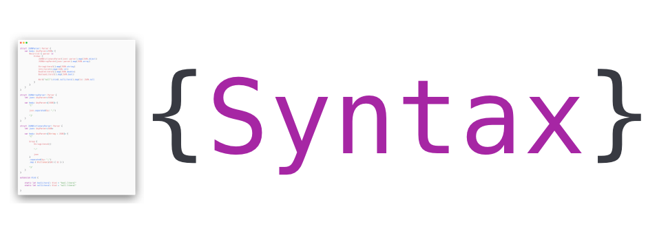

<p align="center">
    
</p>

<p align="center">
    
    <a href="https://swift.org/package-manager">
        
    </a>
    <a href="https://twitter.com/nerdsupremacist">
        
    </a>
</p>

# Syntax

Say goodbye to Scanner's and Abstract Syntax Trees. 
Syntax will take text, and turn it into the model that you actually need.

Syntax is a SwiftUI-like data-driven parser builder DSL. You use composition and functional programming to implement a top-down LL(n) parser with minimal effort.
The result is a Parser tailor made to fit your desired output model ;)

## Installation
### Swift Package Manager

You can install Syntax via [Swift Package Manager](https://swift.org/package-manager/) by adding the following line to your `Package.swift`:

```swift
import PackageDescription

let package = Package(
    [...]
    dependencies: [
        .package(url: "https://github.com/nerdsupremacist/Syntax.git", from: "1.0.0")
    ]
)
```

## Usage

Syntax allows you to write parsers that perfectly fit the model that you want.
For example, let's say you want to parse the output of [FizzBuzz](https://en.wikipedia.org/wiki/Fizz_buzz). 
With syntax you begin writing your model:

```swift
enum FizzBuzzValue {
    case number(Int)
    case fizz
    case buzz
    case fizzBuzz
}
```

And then you can just write a parser. Parser's in Syntax are structs that return a `body` much like in SwiftUI.

```swift
import Syntax

struct FizzBuzzParser: Parser {
    var body: any Parser<[FizzBuzzValue]> {
        Repeat {
            Either {
                IntLiteral().map { FizzBuzzValue.number($0) }

                Word("FizzBuzz").map(to: FizzBuzzValue.fizzBuzz)
                Word("Fizz").map(to: FizzBuzzValue.fizz)
                Word("Buzz").map(to: FizzBuzzValue.buzz)
            }
        }
    }
}
```

Let's break that down:

- `Repeat` signals that it should parse multiple values.
- `Either` signals that you expect any of the following options.
- `IntLiteral` will match the next integer literal it sees.
- `Word` will match the word you give it, and only if it exists by itself.
- `map` will map the value of a parser into something else.
- `map(to:)` will map the value to a constant, useful for matching things like keywords.

To use this parser you can call the `parse` function:

```swift
let text = "1 2 Fizz"
let values = try FizzBuzzParser().parse(text) // [.number(1), .number(2), .fizz]
```

### Syntax Tree's

Syntax supports outputing an Abstract Syntax Tree. All nodes in the Syntax Tree are annotated with a kind. The kind will be automatically derived from the name of a parser, but you can also specify it yourself:

```swift
import Syntax

struct FizzBuzzParser: Parser {
    var body: any Parser<[FizzBuzzValue]> {
        Repeat {
            Either {
                IntLiteral().map { FizzBuzzValue.number($0) }

                Word("FizzBuzz").map(to: FizzBuzzValue.fizzBuzz).kind("keyword.fizzbuzz")
                Word("Fizz").map(to: FizzBuzzValue.fizz).kind("keyword.fizz")
                Word("Buzz").map(to: FizzBuzzValue.buzz).kind("keyword.buzz")
            }
        }
    }
}
```

To get the AST you can ask for it via the `syntaxTree` function:

```swift
let text = "1 2 Fizz"
let tree = FizzBuzzParser().syntaxTree(text)
```

The AST is Encodable, so you can encode it into JSON. For example:

```json
{
  "startLocation": { "line": 0, "column": 0 },
  "kind": "fizz.buzz",
  "startOffset": 0,
  "endLocation": { "line": 0, "column": 8 },
  "endOffset": 8,
  "children": [
    {
      "startLocation": { "line": 0, "column": 0 },
      "kind": "int.literal",
      "startOffset": 0,
      "endLocation": { "line": 0, "column": 1 },
      "endOffset": 1,
      "value": 1
    },
    {
      "startLocation": { "line": 0, "column": 2 },
      "kind": "int.literal",
      "startOffset": 2,
      "endLocation": { "line": 0, "column": 3 },
      "endOffset": 3,
      "value": 2
    },
    {
      "match": "Fizz",
      "startLocation": { "line": 0, "column": 4 },
      "kind": "keyword.fizz",
      "startOffset": 4,
      "endLocation": { "line": 0, "column": 8 },
      "endOffset": 8
    }
  ]
}
```

### Syntax Highlighting

You can use your parser to highlight code on a [Publish](https://github.com/JohnSundell/Publish) Site using this [plugin](https://github.com/nerdsupremacist/syntax-highlight-publish-plugin).


```swift
import SyntaxHighlightPublishPlugin

extension Grammar {
    // define Fizz Buzz Grammar
    static let fizzBuzz = Grammar(name: "FizzBuzz") {
        FizzBuzzParser()
    }
}

try MyPublishSite().publish(using: [
    ...
    // use plugin and include your Grammar
    .installPlugin(.syntaxHighlighting(.fizzbuzz)),
])
```

### More complex parsing

Alright. I hear you. FizzBuzz isn't exactly a challenge. So let's take it up a notch and parse JSON instead.
To be able to parse JSON, we have to understand what JSON even is. JSON consists of 

a) the primitive values like strings, numbers, booleans 
and b) any combinations of objects (dictionaries) and arrays.

So a possible model for JSON would be:

```swift
enum JSON {
    case object([String : JSON])
    case array([JSON])
    case int(Int)
    case double(Double)
    case bool(Bool)
    case string(String)
    case null
}
```

Syntax comes with constructs for most of these out of the box, like: `StringLiteral` and `IntLiteral`. 
So we can rely on those. We can put most of our cases in an `Either` which will try to parse whichever case works:

```swift
struct JSONParser: Parser {
    var body: any Parser<JSON> {
        Either {
            /// TODO: Arrays and Objects

            StringLiteral().map(JSON.string)
            IntLiteral().map(JSON.int)
            DoubleLiteral().map(JSON.double)
            BooleanLiteral().map(JSON.bool)
                
            Word("null").map(to: JSON.null)
        }
    }
}
```

You will notice that we put a `map` at the end of each line. 
This is because parsers like `StringLiteral` will return a String and not JSON. So we need to map that string to JSON.

So the rest of our job will go into parsing objects and literals. The first thing we notice though is that Arrays and Objects need to parse JSON again. 
This recursion needs to be stated explicitely. To use a Parser recursively, we implement a different protocol called `RecursiveParser`: 

```swift
struct JSONParser: RecursiveParser {
    var body: any Parser<JSON> {
        Either {
            /// TODO: Arrays and Objects

            StringLiteral().map(JSON.string)
            IntLiteral().map(JSON.int)
            DoubleLiteral().map(JSON.double)
            BooleanLiteral().map(JSON.bool)
                
            Word("null").map(to: JSON.null)
        }
    }
}
```

The name `RecursiveParser` describes quite accurately what it does. It's a `Parser`, which can have a cycle inside. 
**Note:** the protocol `RecursiveParser` expects that your Parser type will also conform to `Hashable`. 
If your type only has `Hashable` properties, this conformance will be synthesized by the compiler.

Now, let's get parsing of these recursive definitions going.
We can start with arrays. We can create an array parser that will parse multiple values of `JSON` separated by commas, inside `[` and `]`. In Syntax that looks like this:

```swift
struct JSONArrayParser: Parser {
    var body: any Parser<[JSON]> {
        "["

        // we can just reuse our JSON Parser here.
        JSONParser()
            .separated(by: ",")

        "]"
    }
}
```

Easy, right? It's pretty much what we said in words. Dictionaries are pretty similar, except that we have a key-value pairs separated by commas:

```swift
struct JSONDictionaryParser: Parser {
    var body: any Parser<[String : JSON]> {
        "{"

        // Group acts kinda like parenthesis here.
        // It groups the key-value pair into one parser
        Group {
            StringLiteral()

            ":"

            JSONParser()
        }
        .separated(by: ",")
        .map { values in
            // put the pairs in a dictionary
            return Dictionary(values) { $1 }
        }

        "}"
    }
}
```

And for the final act, we add those two to our `Either` for JSON:

```swift
struct JSONParser: RecursiveParser {
    var body: any Parser<JSON> {
        Either {
            JSONDictionaryParser().map(JSON.object)
            JSONArrayParser().map(JSON.array)

            StringLiteral().map(JSON.string)
            IntLiteral().map(JSON.int)
            DoubleLiteral().map(JSON.double)
            BooleanLiteral().map(JSON.bool)
                
            Word("null").map(to: JSON.null)
        }
    }
}

let text = "[42, 1337]"
let json = try JSONParser().parse(text) // .array([.int(42), .int(1337)])
```

## Contributions
Contributions are welcome and encouraged!

## License
Syntax is available under the MIT license. See the LICENSE file for more info.
